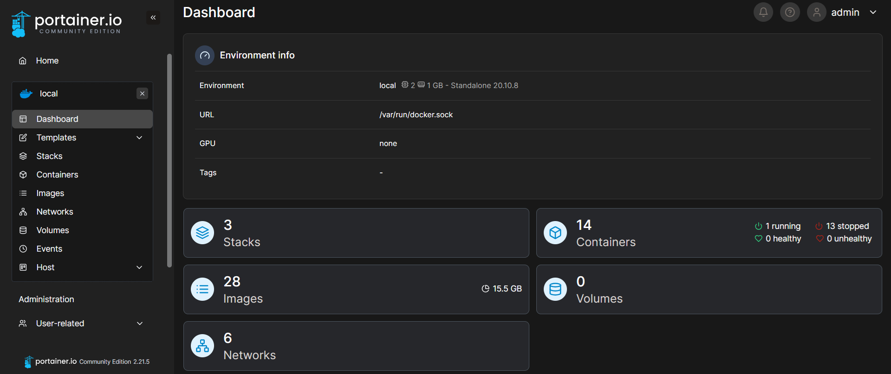

<h1 id="top" align="center">Portainer</h1>

<br>

<div align="center">
    
</div>

<br>

## 🔍 Table of Contents

- [About Project](#intro)
- [Dashboard](#dashboard)
- [Technologies](#technologies)
- [Features](#features)
- [Releases](#releases)
- [System Startup](#system-startup)
- [Contributors](#contributors)

<br/>

<h2 id="intro">📌 About Project</h2>

This project aims to simplify the use of Portainer with pre-configured settings, including persistent named volume and Docker Compose for container management.

<br/>

<h2 id="dashboard">🐳 Dashboard</h2>

<div align="center">
    
</div>

<br/>

<h2 id="technologies">☄️ Technologies</h2>

&nbsp; [](https://www.docker.com/)

&nbsp; [](https://www.portainer.io/)

&nbsp; [](https://www.ibm.com/docs/bg/aix/7.2?topic=files-env-file)

<br/>

<h2 id="features">🔥 Features</h2>

- **Docker Containerization:** The application is containerized using Docker to ensure consistent deployment, scalability, and isolation across different environments.
- **Docker Compose Deployment:** Simplifies deployment with Docker Compose configuration, enabling easy setup and service orchestration without complex commands.
- **Network Compatibility:** Uses shared Docker network to work with other services.
- **Persistent Data:** Utilizes a named Docker volume to ensure persistent storage of application data, allowing data to persist across container restarts, rebuilds, and removals.
- **.env Configuration:** All environment variables are easily configurable using the `.env` file, simplifying configuration management.
- **Predefined Admin Credentials:** Allows the use of a predefined admin password stored in a configuration file.

<br/>

<h2 id="releases">🚢 Releases</h2>

&nbsp; [](https://github.com/ahmettoguz/core-portainer/tree/v1.4.1)

&nbsp; [](https://github.com/ahmettoguz/core-portainer/tree/v1.4.0)

&nbsp; [](https://github.com/ahmettoguz/core-portainer/tree/v1.3.0)

&nbsp; [](https://github.com/ahmettoguz/core-portainer/tree/v1.2.0)

&nbsp; [](https://github.com/ahmettoguz/core-portainer/tree/v1.1.0)

&nbsp; [](https://github.com/ahmettoguz/core-portainer/tree/v1.0.0)

<br/>

<h2 id="system-startup">🚀 System Startup</h2>

- Create a new directory named `orchestration`.

```
mkdir orchestration
cd orchestration
```

- Clone project.

```
git clone https://github.com/ahmettoguz/orchestration-portainer
```

- Create `.env` file based on the `.env.example` file with credentails.

```
cp .env.example .env
```

- Generate secure password.

```
docker run --rm alpine sh -c "apk add --no-cache openssl && openssl rand -base64 32"
```

- Create `portainer_password` file based on the `portainer_password.example` file and modify it to set secure initial admin password.

```
cp portainer_password.example portainer_password
```

- Create `network-orchestration` network if not exists.

```
docker network create network-orchestration
```

- Manage Container.

```
docker stop                           orchestration-portainer-c
docker rm                             orchestration-portainer-c
docker volume rm                      volume-portainer
docker compose -p orchestration up -d service-portainer
docker logs -f                        orchestration-portainer-c
```

<br/>

<h2 id="contributors">👥 Contributors</h2>

<a href="https://github.com/ahmettoguz" target="_blank"></a>

### [🔝](#top)
